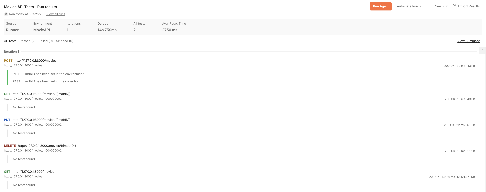

# posterizer(.ai?)

## Database
<details>
<summary>Expand for Database Information</summary>
––––––––––––––––––––––––––––

This database is a crucial part of our final project designed to generate movie posters based on plot input. The system manages movie data using MongoDB, where each movie's metadata—such as title, rating, genre, director, actors, and plot—is stored in a `movieDetails` collection. The ultimate goal is to feed movie plots into a custom algorithm that generates corresponding movie posters, using descriptive key characteristics associated with each poster.

### Data Model
The `movieDetails` collection in the `movies` database has the following structure:

```json
{
  "imdbID": "string",          // The unique IMDb ID for the movie.
  "title": "string",            // The movie's title.
  "rating": "string",           // The movie's rating (e.g., PG-13, R).
  "runtimeMinutes": "string",   // Runtime of the movie in minutes.
  "releaseDate": "string",      // Date of release.
  "genre": ["string"],          // An array of genres the movie belongs to.
  "director": "string",         // The director of the movie.
  "writers": ["string"],        // An array of writers involved in the movie.
  "actors": ["string"],         // An array of the main actors in the movie.
  "plot": "string",             // A brief description of the plot.
  "posterLink": "string"        // URL to the movie's poster image.
}
```
Note: Additional fields like `Estimated Budget` and `Poster Key Characteristics` to be added later once we integrate OpenAI for poster generation.

### Reason for Choosing MongoDB
MongoDB was selected for its flexibility in handling unstructured and semi-structured data. Movie metadata can be complex and diverse, including nested objects (e.g., actors, writers) and arrays (e.g., genres), and MongoDB’s schema-less design allows for this variability without rigid table structures like SQL databases.

Additionally, MongoDB allows for rapid iteration and evolution of the data model, making it ideal for handling the dynamic nature of this project, especially as we work toward integrating movie plot-based poster generation.

### Database Configuration
1. **Collaborator Access:**
   - Admin adds collaborators as necessary in MongoDB Atlas.
   - Once added, each member can generate their own MongoDB connection string via MongoDB Atlas. This will ensure that team members can independently connect to the shared database.

2. **Configure Environment Variables:**
   - Once the connection string acquired, create a `.env` file in the project root directory.
   - Add your MongoDB Atlas connection string (URI) to this file:
     ```
     MONGODB_URI=mongodb+srv://<username>:<password>@movies.7r39n.mongodb.net/movies?retryWrites=true&w=majority&ssl=true
     ```
   - Replace `<username>` and `<password>` with your credentials.

3. **Run the Top Snippet to Connect to the Database:**
   - Use the provided database connection code snippet from the main project (as in the example below) to verify the connection and begin interacting with the database.
   ```python
   import os
   from dotenv import load_dotenv
   import pymongo

   # Load environment variables from .env
   load_dotenv()
   mongodb_uri = os.getenv('MONGODB_URI')

   try:
      # Create a MongoDB client and connect to the 'Movies' database
      client = pymongo.MongoClient(mongodb_uri)
      db = client.get_database("movies")
      movieDetails = db.get_collection("movieDetails")
      
      # Verify the connection
      client.server_info()
      print("Connected successfully to the 'Movies' database!")

   except pymongo.errors.ConnectionFailure as e:
      print(f"Could not connect to MongoDB: {e}")
      exit(1)
   ```

4. **Database Design:**
   - The database contains a `movies` database with a `movieDetails` collection, where each document represents a movie and its associated metadata such as plot, rating, genre, actors, and key characteristics for poster generation.

5. **Populating the Database:**
   - Data insertion into the `movieDetails` collection is done either manually or through automated scripts. The system will later integrate modules for generating movie posters based on plot descriptions.
   - **Bulk Movie Insertion**
      You can use this code snippet to process and insert multiple movies into the database in bulk. The batch size is adjustable to respect the OMDB API’s daily rate limits.
      ```python
      lastIndex = 0  # Update based on lastIndex from previous run
      dailyBatchSize = 100000  # Max API calls within daily limit

      for imdbID in mainDF.imdb_id[lastIndex:lastIndex + dailyBatchSize]:
         response, indexInDF = get_omdb_response(imdbID)
         if response["Response"] == "False":
            print(f"Error fetching data for imdbID: {imdbID}. Skipping...")
            continue        
         elif response["Response"] == "True":
            add_movie_details(imdbID, response, indexInDF)

      lastIndex += dailyBatchSize
      print(lastIndex) # update and print to initialize lastIndex value
      ```
### **Data Pipeline Summary**
- Insert Movie Metadata: This script allows for the insertion of movie metadata into the `movieDetails` collection. 
- Fetch from OMDB API: The OMDB API is used to fetch movie data based on IMDb IDs, and the results are processed and stored in MongoDB.  
- Custom Poster Generation (Coming Soon): The next phase will involve integrating OpenAI to generate key characteristics for movie posters based on the movie plot.
</details>

## API
<detailsd>
<summary>Expand for API Information</summary>
––––––––––––––––––––––––––––

This is a FastAPI-based RESTful API for managing a collection of movies stored in a MongoDB database. The API allows users to retrieve, add, update, and delete movie details, such as title, rating, runtime, release date, genre, director, writers, actors, and more , based on the IMDb ID. The API serves as part of a movie management system, which interacts with the MongoDB `movieDetails` collection.

## Features

- **Get all movies**: Retrieve all movies stored in the database.
- **Get a movie by IMDb ID**: Fetch details for a specific movie using its IMDb ID.
- **Add a new movie**: Insert a new movie into the database.
- **Update a movie**: Update details of a movie using its IMDb ID.
- **Delete a movie**: Remove a movie from the database by its IMDb ID.

---

## Setup Instructions

### 1. Set up the MongoDB Database
Follow the instructions previously stated in the DataBase section of the README file. Before moving on, make sure your `.env` file includes the MongoDB connection string you requested from us and the path to the imdB file like so:

```bash
Mongo_URI=mongodb://<username>:<password>@<cluster-url>/<dbname>?retryWrites=true&w=majority
IMDB_PROCESSED_DF_PATH=/Users/yourusername/Movie_Creation_Tool/imdbProcessed_1.csv
```

### 2. Install Dependencies
Create a virtual environment and install packages using `requirements.txt` by running the following commands on your terminal:

```bash
# To create the virtual environment
python3 -m venv .venv

# To activate the virtual environment
source .venv/bin/activate  # On MacOS/Linux
.venv\Scripts\activate  # On Windows

# To install dependencies
pip install -r requirements.txt
```

### 3. Run the API Application

Move to the API directory then run the py file:

```bash
cd api
python apiMain.py
```

### 4. Sample output

After running the API, you should get an output similar to this:

  ```
Connected successfully to the 'Movies' database!
imdbID='tt1517268' title='Barbie' rating='PG-13' runtimeMinutes=114.0 releaseDate='2023-07-19' genre=['Adventure', 'Comedy', 'Fantasy'] director='Greta Gerwig' writers=['Greta Gerwig', 'Noah Baumbach'] actors=['Margot Robbie', 'Ryan Gosling', 'Issa Rae'] plot='Barbie and Ken are having the time of their lives in the colorful and seemingly perfect world of Barbie Land. However, when they get a chance to go to the real world, they soon discover the joys and perils of living among humans.' posterLink='https://m.media-amazon.com/images/M/MV5BNjU3N2QxNzYtMjk1NC00MTc4LTk1NTQtMmUxNTljM2I0NDA5XkEyXkFqcGdeQXVyODE5NzE3OTE@._V1_SX300.jpg'
  ```
---
## Interacting with POSTMAN

### 1. Setup

Install the POSTMAN extension on Visual Studio Code (if you don't have it already install) and sign up. Run the following command on your terminal 

```
uvicorn api.apiMain:app --reload
```
The following line should appear, indicating that the request was successful:

```
INFO:     127.0.0.1:55293 - "GET / HTTP/1.1" 200 OK
```
You should also get the following line, indicating that you can access the application by navigating to http://127.0.0.1:8000 (in a web browser or using Postman like we will be doing):

```
INFO:     Uvicorn running on http://127.0.0.1:8000 (Press CTRL+C to quit)
```
Launch the POSTMAN extension on Visual Studio Code and sign in.

#### Our 5 main API commands are stored under the Movies API Tests Collection
1. `POST/http://127.0.0.1:8000/movies`
2. `GET/http://127.0.0.1:8000/movies/{{imdbID}}`
3. `POST/http://127.0.0.1:8000/movies/{{imdbID}}`
4. `DELETE/http://127.0.0.1:8000/movies/{{imdbID}}`
5. `GET/http://127.0.0.1:8000/movies`

### **MAKE SURE YOUR DB HAS UNIQUE INDEXES FOR API TESTING**

### 2. Interaction
#### Postman Setup for Running API Commands

**Collection Variables:** In order to run the requests using the collection, we set up `{{imdbID}}` as a collection variable for requests that require keying using `imdbID`. (You can set this variable manually or use scripts in the **Scripts** tab of your **POST** request to set it dynamically)

* Example of a script to set the `imdbID` after creating a movie:

```js
let responseJson = pm.response.json();
pm.collectionVariables.set("imdbID", responseJson.imdbID);
pm.test("imdbID has been set in the collection", function () {
    pm.expect(pm.collectionVariables.get("imdbID")).to.eql(responseJson.imdbID);
});
```

**Environment Variables:** Alternatively, you can set imdbID as an environment variable to use across multiple requests.

* To set an environment variable in the **Scripts** tab, we use:

```js
pm.environment.set("imdbID", pm.response.json().imdbID);
pm.test("imdbID has been set in the environment", function () {
    pm.expect(pm.environment.get("imdbID")).to.eql(responseJson.imdbID);
});
```

**Collection Runner:** To test all requests sequentially, use the Collection Runner in Postman. This helps to automate the testing of each API command in a sequence, ensuring all operations (create, retrieve, update, delete, list) are working properly.

* Before running, we must make sure that the POST request runs first to create a new movie and sets the imdbID variable correctly for use in the GET, PUT, and DELETE requests (except for the last GET request which doesn't require an `imdbID`).

### 3. Sample output of a Collection Run

---

## API Endpoints

### 1. Get All Movies

**Request**: `GET /movies`

**Response**:

```json
[
    {
        "imdbID": "tt1517268",
        "title": "Barbie",
        "rating": "PG-13",
        "runtimeMinutes": 114,
        "releaseDate": "2023-07-21",
        "genre": ["Adventure", "Comedy", "Fantasy"],
        "director": "Greta Gerwig",
        "writers": ["Greta Gerwig", "Noah Baumbach"],
        "actors": ["Margot Robbie", "Ryan Gosling", "Simu Liu"],
        "plot": "Barbie suffers a crisis that leads her to question her world and her existence.",
        "posterLink": "https://someposterurl.com"
    }
]
```

### 2. Get a Movie by IMDb ID

**Request**: `GET /movies/{imdbID}`

- Example: `/movies/tt1517268`

**Response**:

```json
{
    "imdbID": "tt1517268",
    "title": "Barbie",
    "rating": "PG-13",
    "runtimeMinutes": 114,
    "releaseDate": "2023-07-21",
    "genre": ["Adventure", "Comedy", "Fantasy"],
    "director": "Greta Gerwig",
    "writers": ["Greta Gerwig", "Noah Baumbach"],
    "actors": ["Margot Robbie", "Ryan Gosling", "Simu Liu"],
    "plot": "Barbie suffers a crisis that leads her to question her world and her existence.",
    "posterLink": "https://someposterurl.com"
}
```

### 3. Add a New Movie

**Request**: `POST /movies`

**Body** (example):

```json
{
    "imdbID": "tt4154796",
    "title": "Avengers: Endgame",
    "rating": "PG-13",
    "runtimeMinutes": 181,
    "releaseDate": "2019-04-26",
    "genre": ["Action", "Adventure", "Drama"],
    "director": "Anthony Russo, Joe Russo",
    "writers": ["Christopher Markus", "Stephen McFeely"],
    "actors": ["Robert Downey Jr.", "Chris Evans", "Mark Ruffalo"],
    "plot": "After the devastating events of Avengers: Infinity War, the universe is in ruins...",
    "posterLink": "https://someposterurl.com"
}
```

**Response**:

```json
{
    "imdbID": "tt4154796",
    "title": "Avengers: Endgame",
    "rating": "PG-13",
    "runtimeMinutes": 181,
    "releaseDate": "2019-04-26",
    "genre": ["Action", "Adventure", "Drama"],
    "director": "Anthony Russo, Joe Russo",
    "writers": ["Christopher Markus", "Stephen McFeely"],
    "actors": ["Robert Downey Jr.", "Chris Evans", "Mark Ruffalo"],
    "plot": "After the devastating events of Avengers: Infinity War, the universe is in ruins...",
    "posterLink": "https://someposterurl.com"
}
```

### 4. Update a Movie by IMDb ID

**Request**: `PUT /movies/{imdbID}`

- Example: `/movies/tt4154796`

**Body** (similar to the `POST` body):

```json
{
    "imdbID": "tt4154796",
    "title": "Avengers: Endgame",
    "rating": "PG-13",
    "runtimeMinutes": 181,
    "releaseDate": "2019-04-26",
    "genre": ["Action", "Adventure", "Drama"],
    "director": "Anthony Russo, Joe Russo",
    "writers": ["Christopher Markus", "Stephen McFeely"],
    "actors": ["Robert Downey Jr.", "Chris Evans", "Mark Ruffalo"],
    "plot": "After the devastating events of Avengers: Infinity War, the universe is in ruins...",
    "posterLink": "https://someposterurl.com"
}
```

**Response**:

```json
{
    "imdbID": "tt4154796",
    "title": "Avengers: Endgame",
    "rating": "PG-13",
    "runtimeMinutes": 181,
    "releaseDate": "2019-04-26",
    "genre": ["Action", "Adventure", "Drama"],
    "director": "Anthony Russo, Joe Russo",
    "writers": ["Christopher Markus", "Stephen McFeely"],
    "actors": ["Robert Downey Jr.", "Chris Evans", "Mark Ruffalo"],
    "plot": "After the devastating events of Avengers: Infinity War, the universe is in ruins...",
    "posterLink": "https://someposterurl.com"
}
```

### 5. Delete a Movie by IMDb ID

**Request**: `DELETE /movies/{imdbID}`

- Example: `/movies/tt4154796`

**Response**:

```json
{
    "message": "Movie deleted successfully"
}
```

---

## Conclusion

This API enables users to manage movie details via a RESTful interface. You can use tools like Postman to interact with it, or integrate it into a larger system that requires movie management functionality.

</details>
